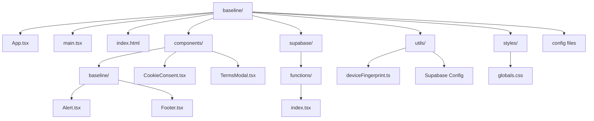

# Baseline
<!-- Badges -->


<div align="center">
  <a href="https://baselineapp.figma.site/" target="_blank">
    
  </a>
</div>

A responsive web application that helps freelancers calculate minimum acceptable project prices using structured inputs and deterministic logic. Baseline is a pricing decision system built for free[...]  

Rather than telling you “what to charge,” Baseline defines the minimum price that makes sense for the work and your current availability. Anything below that line is no longer negotiable. The [...]  

## Overview

Baseline provides a smart pricing calculator with three user tiers:
- **Preview Mode**: 5 calculations without an account
- **Free Account**: 5 calculations per account with authentication
- **Full License**: Unlimited calculations with license key

## Features

- **Smart Pricing Calculator**: Calculate baseline prices based on hours, hourly rate, risk multiplier, and complexity factor
- **User Authentication**: Secure signup and login with Supabase Auth
- **Device Fingerprinting**: Fair usage enforcement to prevent multi-account abuse
- **Responsive Design**: Desktop-first two-column layout with mobile stacked layout
- **Multi-language Support**: English and Spanish interface
- **Privacy-First**: No tracking, minimal data collection, transparent policies
- **Modern UI**: Clean design with custom components, tooltips, and smooth interactions

## Tech Stack

- **Frontend**: React 18 + TypeScript + Tailwind CSS v4
- **Backend**: Supabase (Auth + Database + Edge Functions)
- **Build Tool**: Vite
- **Hosting**: Vercel

## Project Structure
# Project Structure: Baseline



## Key Components

### Calculator Logic
The calculator computes minimum acceptable pricing using:
```
Base Price = Hours × Hourly Rate
Risk-Adjusted Price = Base Price × Risk Multiplier
Final Price = Risk-Adjusted Price × Complexity Factor
```

### Authentication Flow
1. User can use calculator 5 times without account (localStorage tracking)
2. After limit, prompted to sign up
3. Signup creates account with email verification ready
4. Free accounts get 5 calculations (tracked in database)
5. Licensed users get unlimited calculations

### Security Features
- Device fingerprinting prevents multi-account creation
- Secure session management with Supabase Auth
- Service role key isolated to server-side code
- HTTPS-only connections
- Security headers configured

## Credits

Thanks to the tools, libraries, and resources that made this project possible:

- [Figma make](https://www.figma.com) — building and ui design
- [Shadcn UI](https://ui.shadcn.com) — component primitives and design patterns
- [Tailwind CSS](https://tailwindcss.com) — utility-first styling
- [React](https://reactjs.org) — UI library
- [Vercel](https://vercel.com) — deployment and hosting
- [Vite](https://vitejs.dev) — build tooling
- [Supabase](https://supabase.com) — login credentials backend

---

Developed by [@antomarinooo](https://github.com/antomarinooo)

© 2026 | Antonia C. Marino

## License

This project is licensed under the MIT License.